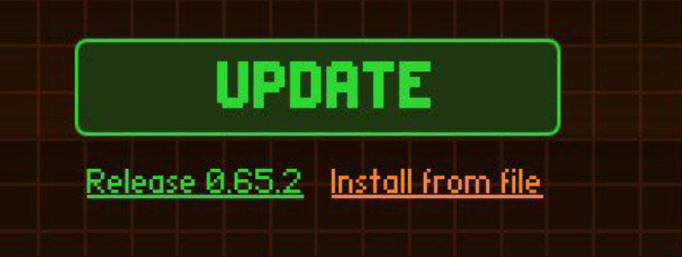
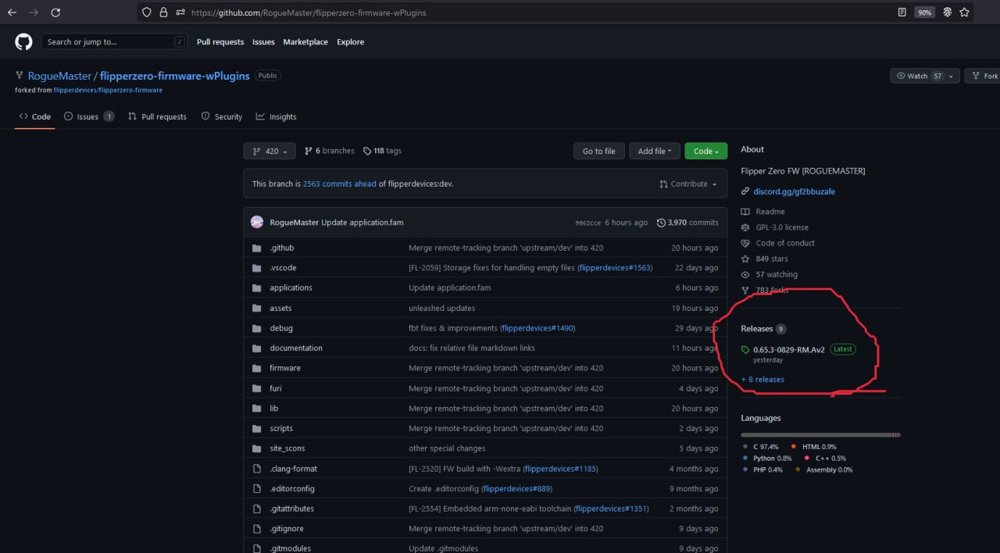
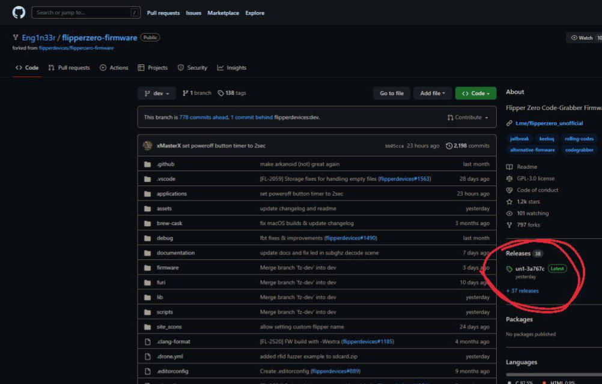
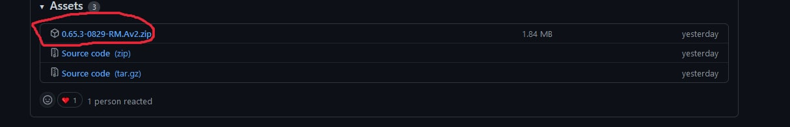
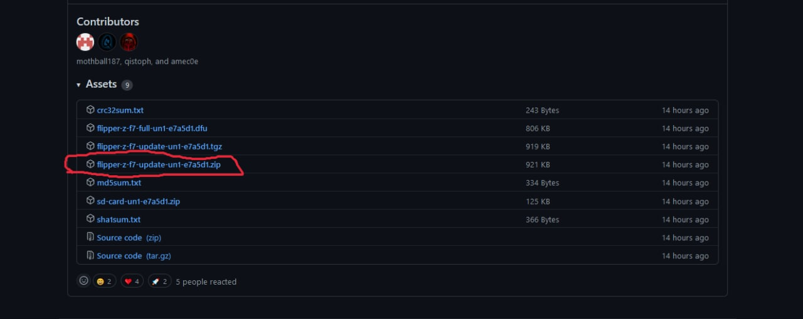
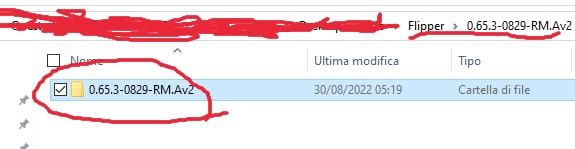
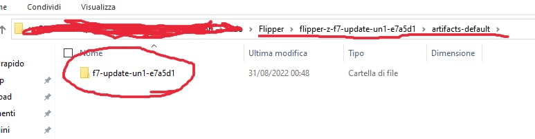
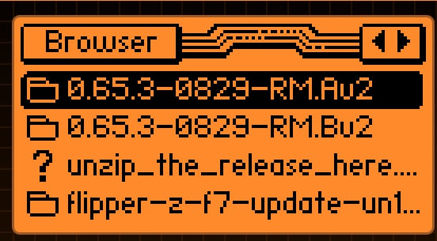
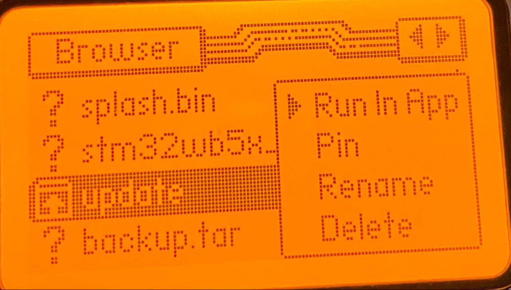

# Primi passi

Ciao, hai appena acquistato il tuo meraviglioso flipper e sei superipermegagasato (a maggior ragione se ti é arrivato tramite UPS che ti avrà fatto venire i sudori freddi) e non hai la più pallida idea di come fare tutte le cose di cui parliamo nel gruppo Telegram?  
Allora cerca di leggere con attenzione le seguenti righe, il procedimento é molto semplice e vedrò di spiegarlo in maniera facile facile:
0. Leggere il foglietto che arriva con il flipper e guardare il sito ufficiale nella sezione documentazione.

Se sei arrivato qui è perché non ci hai capito molto dalla documentazione, nessun problema vediamo come fare in Italiano:

1. Apri il seguente [link](https://flipperzero.one/update) per scaricare l'applicazione **qFlipper** che ti servirà per interagire con il tuo flipper (aggiornare, riparare, usarlo dal computer etcetc).
2. Una volta installato collega il tuo flipper al pc tramite il cavo nella scatola
**Se ne usi uno diverso assicurati che sia un cavo dati e non solo di ricarica!**
3. Adesso procedi premendo il tasto in verde **UPDATE**.  
  
E attendi che completi l'aggiornamento.
4. Il prossimo passaggio, facoltativo ma consigliato, è scaricare vari database da questa sezione della repository di [AwesomeFlipper](https://github.com/djsime1/awesome-flipperzero#databases--dumps).  
	I file scaricati vanno poi inseriti nelle cartelle corrette all'interno della memory card, ovvero:  
		- I file relativi agli infrarossi (con estensione .ir) nella cartella infrared  
		- Quelli relativi ai Sub-ghz (con estensione .sub) nella cartella subghz.  
**AGGIUNGERE TUTTE LE ESTENSIONI / CARTELLE**  
Questi sono file salvati dalle varie persone e condivisi, con la stessa procedura con cui salvate voi i file.  
*Adesso viene il bello, qui di seguito illustrerò come avere entrambi i firmware nella microsd del flipper così da poter scegliere quale installare senza dover rifare la procedura con il computer, ovviamente NON é obbligatorio e potrete scegliere di eseguire i passaggi solo per il firmware che vi interessa, le differenze tra le due versioni le trovare nel regolamento a questo [link](https://github.com/djsime1/awesome-flipperzero/blob/main/Firmwares.md)*.
5. Recatevi nelle rispettive pagine di [Unleashed()](https://github.com/Eng1n33r/flipperzero-firmware) e [Roguemaster](https://github.com/RogueMaster/flipperzero-firmware-wPlugins). Dopodiché nella parte destra della pagina troverete la sezione **Release**, premete sul link indicato nella foto (non deve necessariamente avere la stessa scritta visto che indica la versione).  
  
  
6. Successivamente scorrete verso il basso e cercate questo file che dovrete scaricare:  
   - Rogue:  
     
   - Unleashed:  
     
7. Una volta scaricato procedete a estrarlo e copiare la cartella estratta all'interno della cartella **update** nella memory card.  
   - Rogue:  
     
   - Unleashed:  
     
8. Adesso **ESPELLETE IN MANIERA SICURA LA MEMORY CARD** e inseritela nel flipper, premete verso la freccia verso il basso e poi a sinistra finché non leggerete in alto **browser**, scorrete in basso e aprite la cartella **update**:  
  
e dovreste trovarvi le cartelle che avete copiato nel punto precedente.
9. Aprite la cartella del firmware che vi interessa (se ne può installare solo uno alla volta) e cercate questo file:  
  
10. Una volta trovato premete col tasto centrale e selezionate **Run in app**:  
  
e seguite le indicazioni finché vi darà conferma dell'avvenuta installazione..

Ora siete degli hackerzzzz? No, ovvio per esserlo bisogna studiare e non poco, pensare fuori dagli schemi e fare tanta pratica, ma in ogni caso adesso nelle mani avete un telecomando universale con un ricco database, uno strumento con cui inoziare a capire di più sulla sicurezza informatica, un gruppo con meno persone che chiedono 1000 volte queste info 😉.  
Guardate i tutorial che man mano svilupperemo per capire sempre più le varie funzionalità, se ne volete realizzare uno siete i benvenuti, fatecelo sapere nel gruppo [Telegram](https://t.me/flipperzeroitalia)!
