# **Guida all'installazione dei custom firmware Rogue e Unleashed**

## **1. Prepara il Flipper**
### **1.1 Formatta la Micro SD**
Per prima cosa, inserisci una Micro SD all'interno del tuo Flipper. Per formattarla recati nel menu del flipper premendo il pulsante circolare al centro della pulsantiera di navigazione presente sul dispositivo.

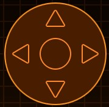

Una volta premuto, ti apparirà il menù sullo schermo del dispositivo. Con le frecce direzionali naviga attraverso il menù fino a quando non incontri la voce **Storage**.

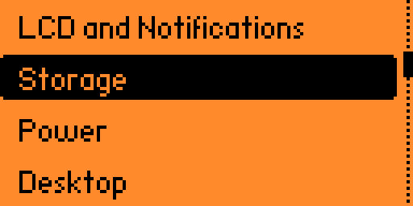

Premi il pulsante centrale e accedi all'ulteriore menù dello **Storage**, nel quale, sempre con le frecce direzionali, dovrai navigare fino alla voce **Format SD Card**.

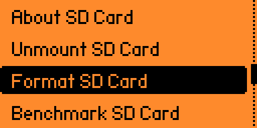

Premi il pulsante circolare centrale e, con la freccia direzionale destra, dovrai dare conferma di voler formattare la SD Card.

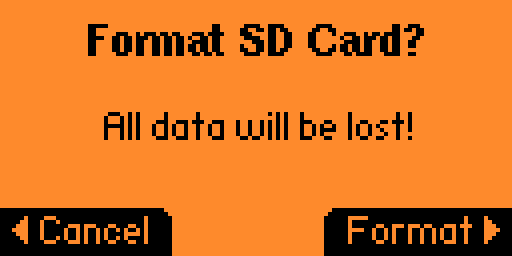

Terminata questa operaizone, la tua SD è pronta per essere sfruttata al meglio dal Flipper.

### **1.2 Scarica e installa il software qFlipper**
Per prima cosa, ti servirà il software ufficiale del Flipper: [qFlipper](https://flipperzero.one/update). Questo software ti servirà per aggiornare il Flipper alle ultime release del firmware ufficiale, per ripristinarlo in caso di problemi, per trasferire file dal tuo Computer al Flipper e tanto altro. Clicca sul seguente [link](https://flipperzero.one/update) per aprire la pagina in cui scaricare il software.

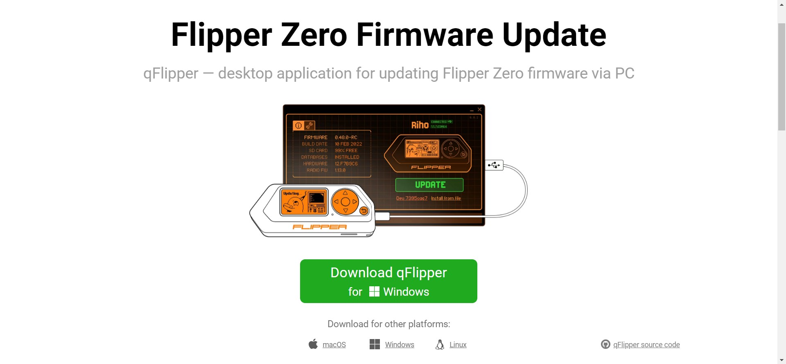

Premi il pulsante verde **Download qFlipper** per iniziare il download dell'installer.

Una volta scaricato avvia l'installazione del software.

## **2. Aggiorna il Flipper**
Per prima cosa, apri il software qFlipper, che comparirà a schermo con questa finestra.

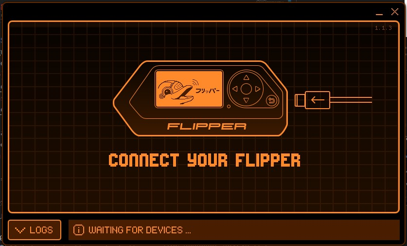

A questo punto, collega il dispositvo al computer tramite  il cavo presente nella confezione che conteneva il Flipper.
**Se ne usi uno diverso assicurati che sia un cavo abilitato al trasferimento dati e non solo di ricarica!**

Una volta collegato, la schermata cambierà, e apparià un bottone che potrebbe riportare la scritta **Install** oppure **Update**.

Qualunque sia il bottone, premilo e attedi che il Flipper si aggiorni e/o che popoli la tua Micro SD con tutti i file necessari.

## **3. Scarica il Custom Firmware**
Alle seguenti pagine sono presenti i repository (i progetti) dei Custom Firmware:
- [Rogue](https://github.com/RogueMaster/flipperzero-firmware-wPlugins)
- [Unleashed](https://github.com/Eng1n33r/flipperzero-firmware)

Una volta aperta una delle due pagine (la procedura è la stessa per entrambi i firmware), vedrai davanti a te una finestra simile a questa:

Sulla destra sono presenti due sezioni, **About** e **Releases**. Nella sezione **Releases** devi premere sul link che riporta il nome della versione con al di sotto una etichetta che invece riporta quanto tempo fa è stata rilasciata.

Una volta cliccato, si caricherà una seconda pagina: scorrete la pagina fino in fondo, nella quale ci sarà una sezione **Assets**. In essa basta premere il **PRIMO** dei tre file per iniziare il download del firmware **Rogue**, mentre dovrete premere il **QUARTO** dei nove file per iniziare il download del firnware **Unleashed**. (Questo ordine potrebbe cambiare, quindi fate attenzione).

- **Rogue** 
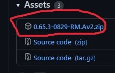

- **Unleasehd** 
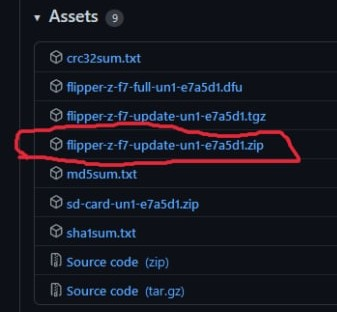

Terminato il download del firmware, ti ritroverai ad avere il relativo file *.zip* all'interno della cartella nel quale hai deciso salvare il file.

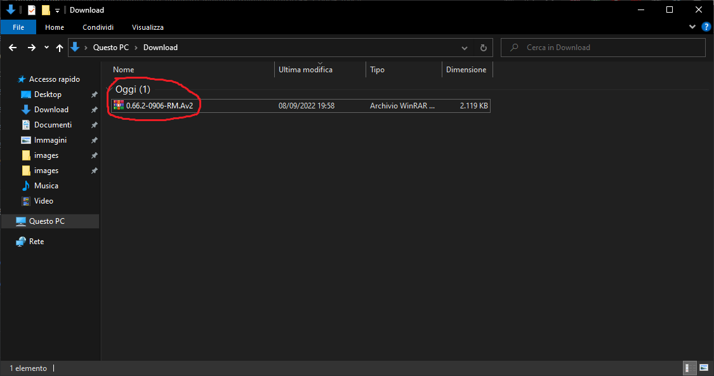

Ora si deve estrarre il file zip. Estraete il contenuto in una cartella omonima, oppure rinominata in modo tale da ricordarvi successivamente che in quella cartella è presenza la versione **N** del custom firmware da voi scelto. Questo potrebbe essere comodo in quanto, una volta nel Flipper vi consentirà di passare da una Firmware di una specifica versione ad un'altra quando vorrete.

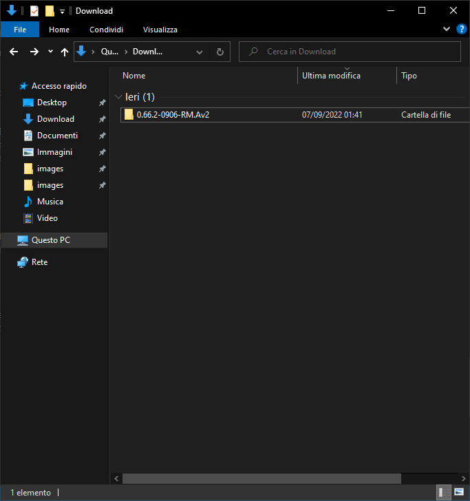

## **4. Installa il Firmware**
### **4.1 Estrai la Micro SD**
Si è pronti ora per installare il custom Firmware. Per prima cosa bisogna estrarre la SD dal Flipper. Per fare ciò recati nel menu del flipper premendo il pulsante circolare al centro della pulsantiera di navigazione presente sul dispositivo.

Una volta premuto, ti apparirà il menù sullo schermo del dispositivo. Con le frecce direzionali naviga attraverso il menù fino a quando non incontri la voce **Storage**.

Premi il pulsante centrale e accedi all'ulteriore menù dello **Storage**, nel quale, sempre con le frecce direzionali, dovrai navigare fino alla voce **Unmount SD Card**.

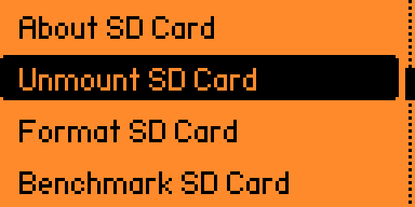

Premi il pulsante circolare centrale e, con la freccia direzionale destra, dovrai dare conferma di voler estrarre la SD Card.

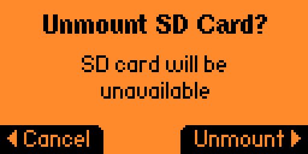

Terminata questa operaizone, la tua SD è pronta per essere inserita nel Computer.

### **4.2 Copia il Custom Firmware**
Inserisci la tua Micro SD nel computer, e aprila. Al suo interno troverai queste cartelle.

Come puoi vedere, è presente una cartella nominata **update**: quello che dovrai fare è copiare la cartella del Custom Firmware estratta al passo **[3](#3-scarica-il-custom-firmware)** all'interno della cartella **update**. Terminata l'operazione di copia, **ESPELLETE IN MODO SICURO LA MEMORY CARD** e inseritela nel Flipper.

### **4.3 Installa il Custom Firmware**
Ora premere la freccia verso il basso per accedere alle *scorciatoie* del Flipper, e scorrere premendo le frecce direzionali **destra** o **sinistra** finché non leggerete in alto **browser**.

 
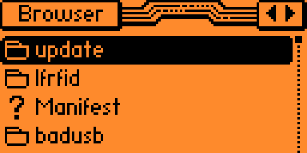

 Scorrere ora verso il basso, fino a quando non troverete la cartella **update**: entrateci dentro premendo il tasto centrale della pulsantiera di navigazione del dispositivo.

 

 Scorrete ora verso il basso fino a quanto non troverete la cartella che avete precedentemente copiato all'interno nel passo **[4.2](#42-copia-il-custom-firmware)**. Quindi entrateci dentro premendo il tasto centrale della pulsantiera di navigazione del dispositivo.
 
 

Una volta dentro, scorrete verso il basso fino a quanto fino a quando non troverete un file chiamato **update**.

 
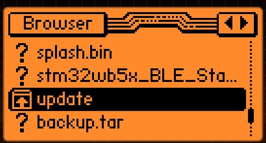

 Una volta dentro, scorrete verso il basso fino a quanto fino a quando non troverete un file chiamato **update**. Premete il tasto centrale della pulsantiera di navigazione del dispositivo.

 

 Vi comparirà un piccolo menù nel quale dovrete scegliere l'opzione **run in app** sempre premendo il tasto centrale della pulsantiera di navigazione del dispositivo. Fatto ciò partità l'installazione del custom Firmware.

 ## **FINE**