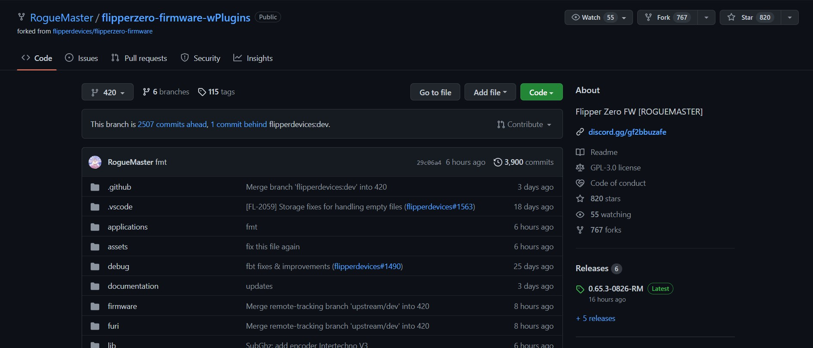
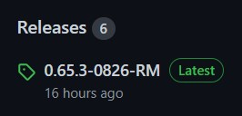
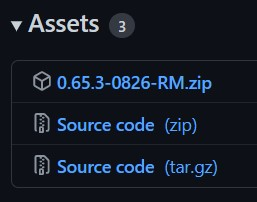

# **Guida all'installazione dei custom firmware Rogue e Unleashed**

## **1. Prepara il Flipper**
Per prima cosa, inserisci una Micro SD all'interno del tuo Flipper. Se la memoria era precedentemente utilizzata per altri scopi, formattala:

## **n. Scarica il Custom Firmware**
Alle seguenti pagine sono presenti i repository (i progetti) dei Custom Firmware:
- [Rogue](https://github.com/RogueMaster/flipperzero-firmware-wPlugins)
- [Unleashed](https://github.com/Eng1n33r/flipperzero-firmware)

Una volta aperta una delle due pagine (la procedura è la stessa per entrambi i firmware), vedrai davanti a te una finestra simile a questa:

Sulla destra sono presenti due sezioni, **About** e **Releases**. Nella sezione **Releases** devi premere sul link che riporta il nome della versione con al di sotto una etichetta che invece riporta quanto tempo fa è stata rilasciata.

Una volta cliccato, si caricherà una seconda pagina: scorrete la pagina fino in fondo, nella quale ci sarà una sezione **Assets**. In essa basta premere il **PRIMO** dei tre file per iniziare il download del firmware che si dovrà successivamente installare.

